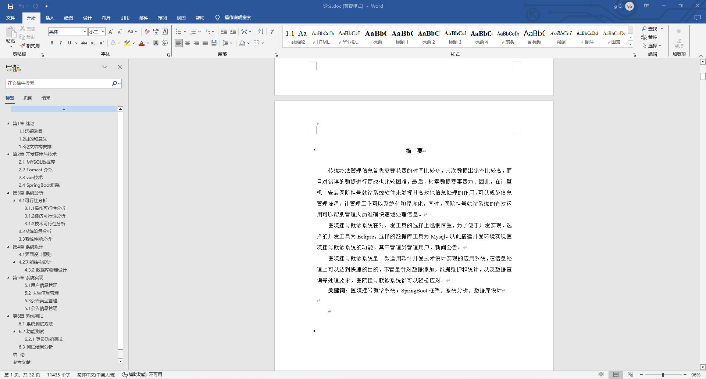
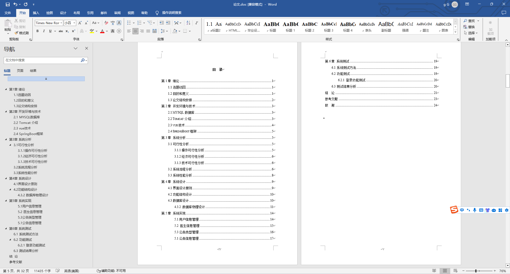
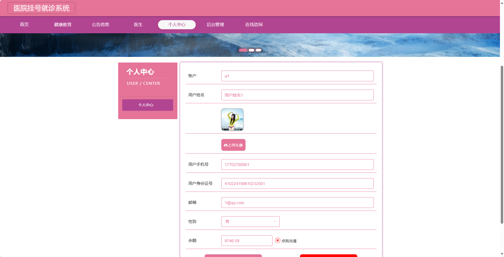
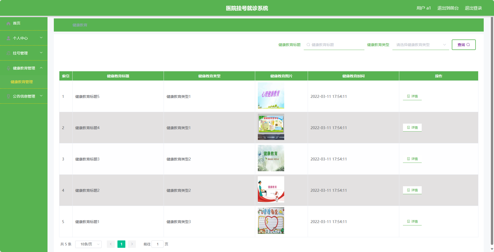
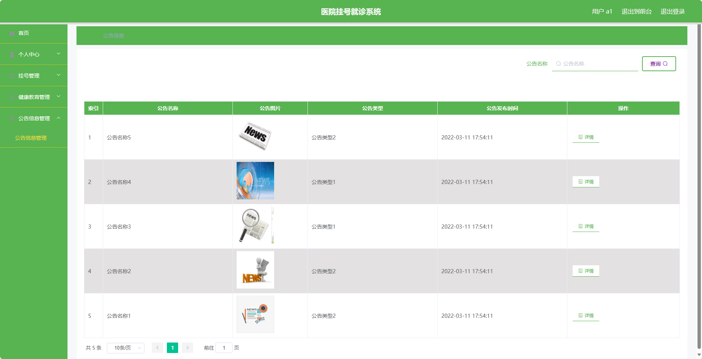
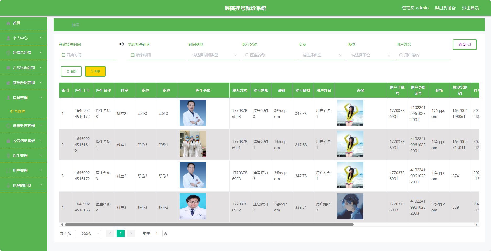

基于SpringBoot的医院挂号就诊系统（程序+论文）
=
- 完整代码获取地址：从戎源码网 ([https://armycodes.com/](https://armycodes.com/))
- 作者微信：19941326836  QQ：952045282 
- 承接计算机毕业设计、Java毕业设计、Python毕业设计、深度学习、机器学习
- 选题+开题报告+任务书+程序定制+安装调试+论文+答辩ppt 一条龙服务
- 所有选题地址https://github.com/nature924/allProject

一、项目介绍
---
基于Spring Boot框架实现的医院挂号就诊系统，系统包含三种角色：管理员、医生、用户,系统分为前台和后台两大模块，主要功能如下。
### 前台：
- 首页：展示医院相关信息、推荐医生等内容。
- 健康教育：提供健康知识、文章等相关内容。
- 公告信息：展示医院的公告及最新动态。
- 医生信息：展示医院的医生信息。
- 个人中心：提供用户管理个人信息、就诊记录等的入口。
- 在线咨询：提供用户与医生进行在线咨询的平台。

### 后台：
- 管理员：
    - 个人中心：管理个人信息。
    - 管理员管理：管理系统管理员的基本信息。
    - 在线咨询管理：管理用户与医生的在线咨询信息。
    - 基础数据管理：管理系统的基础数据信息。
    - 挂号管理：管理用户的挂号信息。
    - 健康教育管理：管理健康教育的相关内容。
    - 公告信息管理：管理医院的公告信息。
    - 医生管理：管理医院的医生信息。
    - 用户管理：管理系统用户的基本信息。
    - 轮播图信息：管理系统首页轮播图的信息。

- 用户：
    - 个人中心：管理个人信息。
    - 挂号管理：预约挂号、查看就诊记录等功能。
    - 健康教育管理：浏览、收藏健康教育内容。
    - 公告信息管理：查看医院公告及最新动态。
    - 医生管理：查看医生信息、预约咨询等功能。

- 医生：
    - 个人中心：管理个人信息。
    - 挂号管理：查看待诊患者、填写诊断记录等功能。
    - 健康教育管理：发布、编辑健康教育内容。
    - 公告信息管理：发布、编辑医院公告及最新动态。

二、项目技术
---
- 编程语言：Java
- 数据库：MySQL
- 项目管理工具：Maven
- 前端技术：VUE、HTML、Jquery、Bootstrap
- 后端技术：Spring、SpringMVC、MyBatis

三、运行环境
---
- 操作系统：Windows、macOS都可以
- JDK版本：JDK1.8以上都可以
- 开发工具：IDEA、Ecplise、Myecplise都可以
- 数据库: MySQL5.7以上都可以
- Tomcat：任意版本都可以
- Maven：任意版本都可以

四、运行截图
---
### 论文截图：

### 程序截图：

